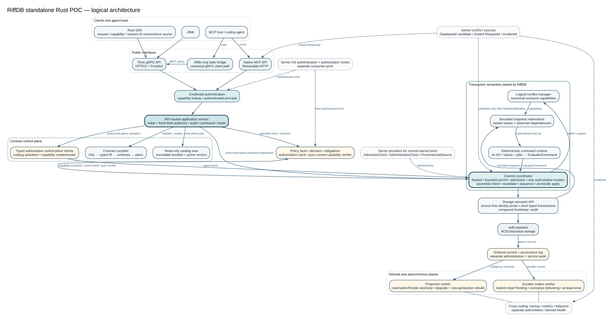

# System Overview

RiffDB is a standalone Rust process with strict ownership boundaries around
public input, deterministic evaluation, and durable authority.

## Public edge

The gRPC server, native MCP adapter, CLI, and generated clients adapt public
requests into API-neutral service operations. They do not own business
semantics or access storage directly. The shared service performs schema-bound
materialization, authentication, authorization, catalog selection, limits, and
redaction.

## Semantic core

The contract compiler owns the transition from source syntax to typed IR and
checked executable plans. The runtime evaluates only compiler-produced plans
against a read snapshot and produces an intent. It has no access to network,
filesystem, operating-system time, process-global mutation, or untracked
randomness.

The conflict manager owns in-memory logical capabilities. It improves admission
and ensures stable acquisition order; authoritative correctness still depends
on transaction-current validation.

## Durable core

The commit coordinator is the only owner allowed to assign application commit
sequences or apply authoritative mutations. Storage exposes semantic snapshot,
scan, and atomic-commit operations rather than arbitrary transaction callbacks.
The redb implementation is replaceable behind that boundary, but durable
encodings and compatibility fixtures are explicit product contracts.

## Derived workers

Outbox delivery and projections consume authoritative commits. Outbox intent is
atomic with a command, while external delivery is not. Projection state is
versioned by generation and frontier and can be rebuilt from authoritative
history.

### Projection result-set provider foundation

WP-645 freezes the compiler-owned vocabulary accepted by ADR-0130. It does not
activate a new public query shape or a composite execution engine.

`ProjectionProviderDescriptorV1` is a 112-byte canonical artifact. It pins one
real provider family, exact or bounded-approximate posture, closed capabilities,
ranked policy mode, exact retained-epoch and rebuildable-generation semantics,
finite input/work/state/diagnostic/candidate/output/measure bounds,
retention/catch-up and deterministic epoch-lease obligations, and one
provider-state layout identity. Its
domain-separated digest is carried by the separately versioned 160-byte
`ProjectionResultSetPlanV1`.
The named `ProjectionResultSetBindingV1` associates that plan with one exact
query operation without changing query IR V1--V4 or query-module V1--V4.

The semantic plan order is fixed: candidates; policy admission and declared
filtering; ranking or exact ordering; whole-admitted-set measures; bounded
windowing; and typed output. Applications cannot select or alter a provider,
capability, policy mode, precision, epoch, stage, scan, fallback, or bridge.
Unsupported combinations are rejected while constructing the compiler artifact.

The existing columnar engine advertises exact partition-scoped candidates,
filters, ordering, whole-set measures/facets, windows, and output. It does not
advertise relevance ranking. The existing per-organization vector engine
advertises candidates, pre-rank filtering, exact or contract-declared ANN
ranking, windows, and output. It does not advertise exact order, measures, or
facets. Existing randomized reference, tenant-statistics isolation, pre-rank
policy admission, and frontier tests remain the execution evidence behind these
descriptors.

ADR-0092 lexical search remains a compile-only thought experiment: a future
descriptor could name lexical candidates, fixed-point ranking, partition-local
statistics, filters, and whole-set measures. WP-645 contains no lexical runtime,
durable lexical state, bitmap/ID transfer, or cross-provider bridge.

Opening a result set observes each finite compiled participant once and chooses
the newest epoch inside their common retained interval. The process-local proof
binds exact query plan, compiled policy shape, descriptor digest, provider-state
schema, history incarnation, generation, floor, and ceiling. It has a fixed
participant ceiling and is deliberately not serializable. Incarnation mismatch,
empty intersection, expired retention, rebuild, retirement, and unavailable
health are closed typed failures.

Descriptor and plan bytes are decoded once per deployment/catalog generation;
lookups share the checked binding. Epoch negotiation runs once per opened result
set or continuation, not per row, candidate, measure, item, page, or provider
call. Authorization and revocation checks remain per request and safe point. A
deterministic admitted-lag monitor turns sustained bound violations into degraded
and then unavailable health.

The maintainer explicitly approved this package after WP-641, WP-642, and
WP-643 closed. The preceding named-read session candidate (WP-650) was rejected
on both N1 and E2 before production activation. WP-645 therefore remains the
bounded ADR-0130 descriptor/conformance slice; it does not displace the standing
c32, unary, or deferred ADR-0127 performance priorities.

### Exact indexed text result sets

WP-646 introduced the `binary_utf8_v1` exact-text provider described by
ADR-0131. WP-647 activates it through named RiffQL and the shared service,
gRPC, CLI, MCP, and generated Rust, Go, TypeScript, and Python surfaces.
Existing prefix text-key and query-module V1--V4 bytes are unchanged; exact
result modules use the additive V5 identity.

The semantic profile compares canonical UTF-8 bytes with no normalization.
Its closed predicates are equality, starts-with, ends-with, and contains.
Missing and null fields never match, and an empty needle is a typed refusal.
Indexed values are limited to 256 bytes, bound needles to 64 bytes, and one
complete policy/partition state to 4,096 rows. Locale rules, case folding,
wildcards, regular expressions, tokenization, stemming, fuzzy matching,
relevance scores, and corpus statistics are deliberately absent.

The compiler enumerates only declared predicate and total-order combinations.
Each total order uses the authoritative canonical entity-key bytes as its unique
tie-breaker. The resulting family pins one exact provider descriptor, complete
partition-aligned or compiler-proven bounded-row policy admission, static
candidate and amplification ceilings, the declaration source span, and the
provider-state schema identity. A separately versioned named binding carries
the domain-separated family hash without rotating the existing query module.
Callers cannot provide a field, operator, order, provider, scan, fallback, or
bridge at runtime.

Provider state is partition-scoped, derived, bounded, and rebuildable. Frozen
V1 remains readable; activated V2 retains canonical entity keys and selected
typed output rows together with partition, generation, and frontier. The
server checkpoint envelope additionally binds query plan, partition, current
application-role definition, row-policy capability identity and revision,
history incarnation, and a domain-separated digest. Unknown, mixed, swapped,
corrupt, or excessive state fails closed. Only the background provider worker
may scan and hydrate authoritative rows; for protected queries it applies one
opaque, complete-candidate admission proof before constructing provider state.
The public execution path uses the ready derived state, negotiates one epoch,
and returns exact count plus indexed ordinal window without a fallback.

The provider is registered lazily for one finite query/partition/policy shape.
Initial build, rebuild, and bounded capacity are typed availability outcomes;
divergence, retention, and freshness use the stable projection application
codes. Authorization is never reused as request authority: the role definition
and current capability revision identify the policy-aligned derived state,
while every request still reauthorizes before provider selection and again
before values cross the public boundary.

## Reactive application path

The accepted P8 architecture reuses authoritative domain events; it does not
create a second event store. The current compiler-proved event partition and
derived route-index foundations let the catalog materialize bounded symbolic
replay from immutable events, commits, writer plans, and provenance. The route
index owns ordering evidence, not payload bytes.

Durable consumer state is operational metadata owned by a dedicated
service coordinator and semantic storage operations. Lease, acknowledgement,
retry, dead-letter, and seek transitions will assign no application commit
sequence and cannot mutate entity state. Possessing a cursor or lease token
will grant no authority; the service reauthorizes the exact database, reactive
definition, partition, and principal for every operation.

A live named query executes once in a consistent snapshot at frontier
`S`, then catches up from authoritative commits after `S`. Compiler-derived
invalidation may conservatively rerun the bounded query, while public clients
receive only the closed snapshot, patch, reset, checkpoint, and terminal
variants. Contextual agent work will compose one durable event with freshly
authorized named-query hydration in one snapshot. Only a later reaction command
writes authoritative state, with causing-event provenance committed atomically
through the normal command path.

The current live-query adapter is gRPC over the shared API-neutral service.
WP-419 adds CLI, generated SDK, MCP, and application-owned browser relay
adapters over those same semantics. MCP notifications remain payload-free
wakeups, and browser clients never receive a RiffDB capability or direct
database connection.

## Crate ownership

Workspace crates are internal architecture boundaries unless specifically
published. Application authors use generated modules and
`riffdb-client-rust`; Python and TypeScript packages expose equivalent stable
application surfaces. Internal crates do not become public merely because
Rustdoc can build them.
