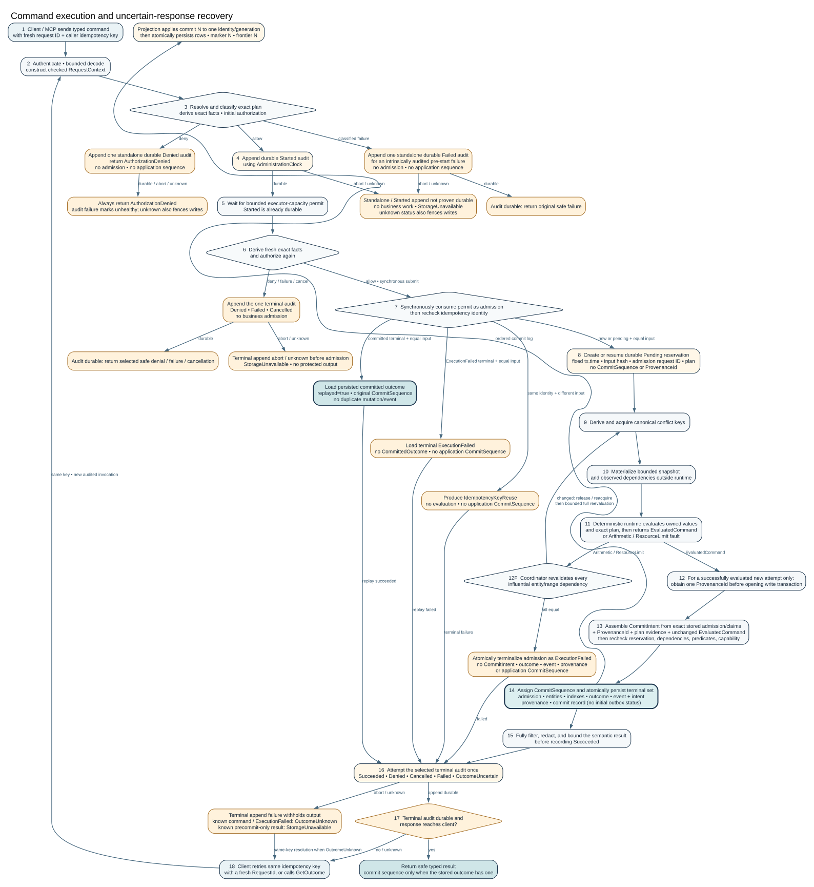

# Command Lifecycle

One command follows the same path whether it arrived through a generated
client, CLI, gRPC, or MCP.

## 1. Select and validate

The request selects a database before authentication. The service authenticates
the database-bound credential, resolves the exact active contract and command,
materializes values under that schema, enforces request limits, and authorizes
the named operation and derived scope.

The idempotency identity is the principal, command identity, caller-owned key,
and canonical input hash. Replaying the same logical command returns the stored
outcome. Reusing the key with different input fails closed.

## 2. Acquire and evaluate

Compiler-derived conflict keys are canonicalized and acquired in a stable
order. Cancellation releases these in-memory capabilities. The runtime reads an
authoritative snapshot, tracks every influential entity, index epoch, and
predicate dependency, and evaluates the executable plan deterministically.

The runtime produces an internal `CommitIntent`; it does not mutate storage or
assign a commit sequence.

## 3. Revalidate and commit

The commit coordinator opens the authoritative write transaction, revalidates
read dependencies against transaction-current state, reevaluates bounded commit
checks, verifies capacity, and then assigns the next sequence.

The encoded reservation includes command-prefix evidence: intermediate entity
and index values needed when a later command in the same physical group
overwrites or deletes them. These bytes share the existing size limits. A
command whose complete reservation exceeds the limit is refused before sequence
assignment; an archive sink is not part of admission or acknowledgement.

For a successful command, the following become durable atomically:

- entity and index mutations;
- the terminal typed outcome;
- durable events and outbox intents;
- provenance; and
- the commit record and its command-prefix evidence.

No response is reported as committed before the configured durability boundary
is satisfied.

## 4. Recover uncertainty

A transport failure after submission does not prove failure. The caller keeps
the original idempotency key and either retries the same canonical input or
resolves the stored outcome. Creating a new key would create a new logical
command.

Derived projection workers consume committed events and advance explicit
frontiers. Their state is rebuildable; command acknowledgement does not depend
on a projection pretending to be authoritative.
